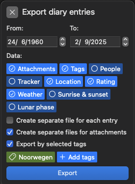
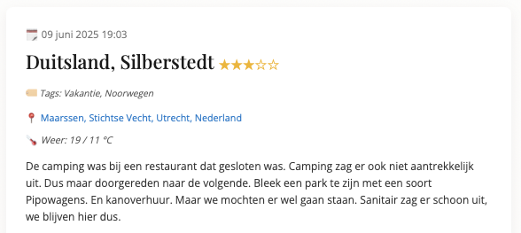
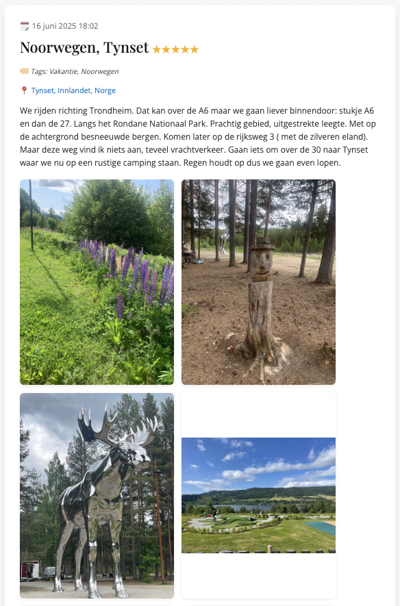
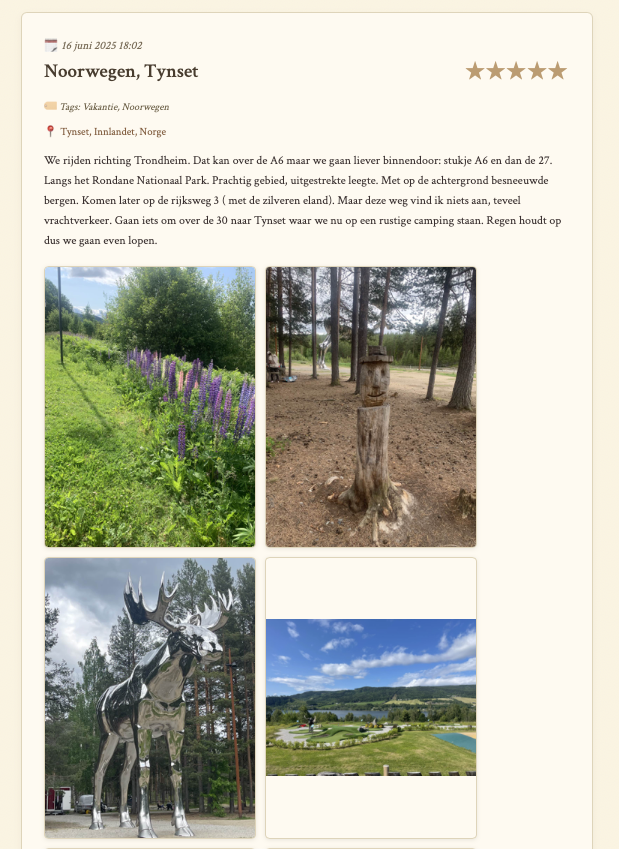
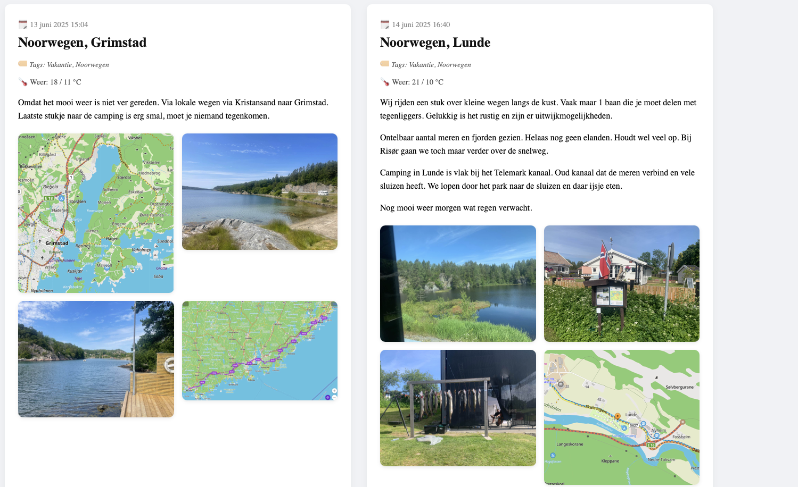
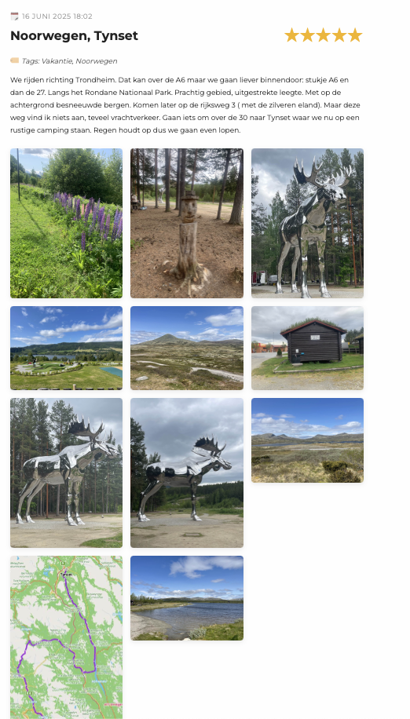

This Python script converts exports from Diarium to HTML pages.
It supports Title, Text, Photos, Tags, Location, Rating, Weather.
No support yet for Tracker, Person. 

**Workflow:**
- Export from Diarium 
- Select the information you want to include in the HTML. If you select "Create separate file for each entry" then the script creates multiple .html files. 

- Click Export, select JSON format
- Uncompress the zip file. The folder contains a .json file and a media folder with the images.
- Place the Diarium2HTML.py file in the folder
- Place a .css file in the folder
- Execute the Diarium2HTML.py script
- This generates HTML file(s)

**Location**

The script can find the location (street, city, country). This is enabled by default.
Conversion takes some time. Except when you disable the location_name then it takes only a few seconds.
To disable the location_name  comment out the line in the script:

`
        # Comment out the next line to exclude location names.
            location_name = get_location_name(lat, lon)
`

**HTML**
The page title shows Date and Time, Title, Rating, Tags, Location, Weather and Text
Remember Tags, Location, Rating and Weather can be selected / deselected when exporting the json

**Sample page with photos: modern.css**

**Sample page: vintage.css**

**Sample page: wrap.css**

These style don't need a change in code, only in css

**Sample page: travel.css**

